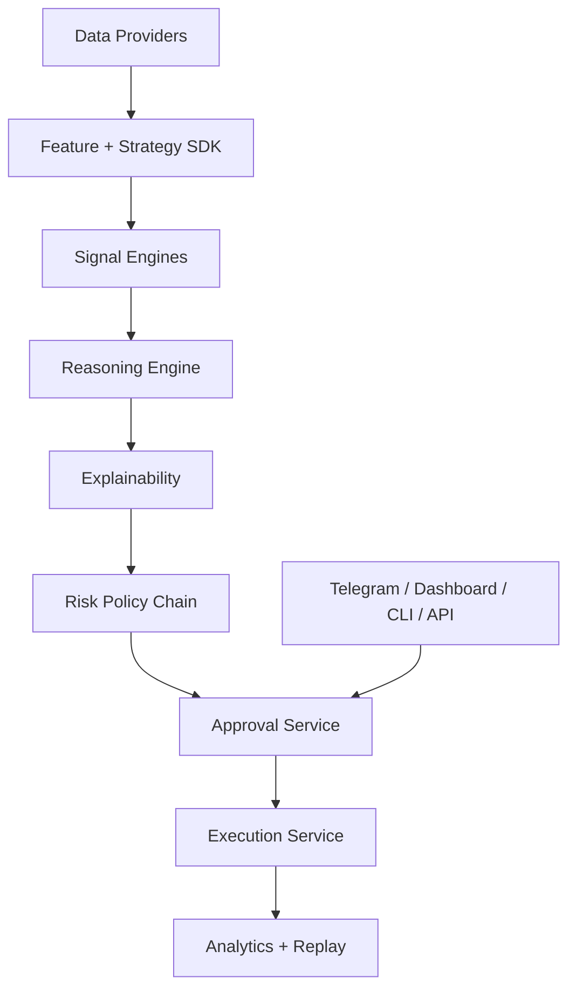

# AI Trading Framework

[](https://github.com/adaline-ankit/ai-trading-framework/actions/workflows/ci.yml)
[](https://github.com/adaline-ankit/ai-trading-framework/actions/workflows/docker.yml)
[](https://github.com/adaline-ankit/ai-trading-framework/actions/workflows/release.yml)
[](LICENSE)
[](pyproject.toml)

Open-source framework for building approval-first AI trading copilots, Telegram trading assistants, and replayable trading workflows.

This project is not an autonomous stock picker. The default operating model is:

`research -> signal generation -> AI reasoning -> explainability -> risk guardrails -> approval -> execution -> analytics`

## Why This Exists

Most AI trading repositories are one-off bots, notebooks, or strategy bundles. `ai-trading-framework` is intended to be the reusable layer underneath:

- Telegram-first trading assistants
- human-in-the-loop broker execution systems
- AI research and signal copilots
- paper trading and replayable operator simulations
- plugin ecosystems for strategies, brokers, data providers, and reasoning engines

## What You Can Build With It

- approval-first AI trading copilots
- Telegram trading operators
- research and signal pipelines
- paper-trading sandboxes
- broker-connected operator consoles
- plugin packages for strategies, brokers, and providers

## Core Capabilities

- Strategy SDK for one-file strategy authoring
- plugin interfaces for strategies, providers, brokers, notifiers, risk policies, and LLMs
- event-driven workflow engine with replay support
- explainability and deterministic risk policy chain
- dashboard, Telegram, API, and CLI surfaces on one runtime
- Postgres-backed operator auth sessions and durable broker connectivity
- paper broker and approval-gated live broker path
- instrument-aware broker model for equities, ETFs, futures, options, commodities, currencies, and mutual-fund workflows
- Railway example deployment, plus generic Docker deployment support

## Architecture



For a fuller view, see [docs/architecture.md](docs/architecture.md).

## Quickstart

### 1. Install

```bash
uv sync --extra dev
```

### 2. Scaffold a bot project

```bash
uv run ai-trading init my-bot --template paper-sandbox
cd my-bot
cp .env.example .env
uv run ai-trading doctor
```

### 3. Run local sandbox mode

```bash
uv run ai-trading sandbox
```

### 4. Generate a recommendation

```bash
uv run ai-trading scan INFY
uv run ai-trading recommend
uv run ai-trading watchlist add SBIN
```

### 5. Start the API

```bash
uv run ai-trading run --reload
```

### 6. Run tests

```bash
uv run pytest
```

Shortcut targets are also available:

```bash
make dev
make check
make run
```

For a fuller local path, see [docs/quickstart.md](docs/quickstart.md).

## Deployment

The framework is deployable anywhere a Python app or container can run.

- generic deployment guide: [docs/deployment.md](docs/deployment.md)
- Railway example: [docs/deployment_railway.md](docs/deployment_railway.md)
- Docker image: [deploy/docker/Dockerfile](deploy/docker/Dockerfile)
- local stack: [docker-compose.yml](docker-compose.yml)

Railway is included as a fast hosted example, not a platform requirement.

## Authentication

The runtime supports:

- `AUTH_MODE=PASSWORD` for bootstrap or single-admin deployments
- `AUTH_MODE=OIDC` for external identity providers
- `AUTH_MODE=HYBRID` for OIDC with a password fallback

Operator sessions are stored in the database, not on disk. Broker connection state is also persisted in Postgres.

## Telegram And Operator UX

The framework ships with:

- Telegram webhook and outbound bot support
- inline Telegram approve/reject/why/risk actions
- interactive production dashboard
- approval queue, positions, replay, and history reset

Docs:

- [docs/telegram.md](docs/telegram.md)
- [docs/brokers_zerodha.md](docs/brokers_zerodha.md)

## CLI

```bash
ai-trading init
ai-trading doctor
ai-trading status
ai-trading watchlist add INFY
ai-trading watchlist list
ai-trading recommend
ai-trading run --reload
ai-trading scan INFY
ai-trading analyze INFY
ai-trading backtest INFY
ai-trading replay <run-id>
ai-trading benchmark INFY
ai-trading invest 10000 INFY TCS SBIN --broker PAPER
ai-trading connect-telegram
ai-trading login-zerodha
ai-trading sandbox
ai-trading deploy
```

## Examples

- [examples/paper_trading_bot](examples/paper_trading_bot)
- [examples/telegram_zerodha_bot](examples/telegram_zerodha_bot)
- [examples/custom_strategy](examples/custom_strategy)
- [examples/sandbox_demo](examples/sandbox_demo)

## Docs

- [Quickstart](docs/quickstart.md)
- [Architecture](docs/architecture.md)
- [Framework Deep Dive](docs/framework_deep_dive.md)
- [Build With The Framework](docs/build_with_framework.md)
- [Unified Bot Product Spec](docs/unified_bot_product_spec.md)
- [Unified Bot Checklist](docs/unified_bot_checklist.md)
- [Unified Bot End State](docs/unified_bot_end_state.md)
- [Deployment](docs/deployment.md)
- [Railway Deployment](docs/deployment_railway.md)
- [Strategy SDK](docs/strategy_sdk.md)
- [Plugins](docs/plugins.md)
- [Replay](docs/replay.md)
- [Explainability](docs/explainability.md)
- [Telegram](docs/telegram.md)
- [Zerodha](docs/brokers_zerodha.md)
- [Public Launch Checklist](docs/public_launch_checklist.md)

## Project Status

Current strengths:

- strong paper-trading and operator workflow support
- replayable, approval-first execution model
- Telegram and dashboard operator surfaces
- plugin-oriented framework structure

Remaining external or optional steps for a fully complete launch:

- fully verified live Zerodha execution on the production account
- optional OIDC provider setup for multi-user SSO
- optional PyPI publish credentials

## Contributing

Start with:

- [CONTRIBUTING.md](CONTRIBUTING.md)
- [CHANGELOG.md](CHANGELOG.md)
- [SECURITY.md](SECURITY.md)
- [CODE_OF_CONDUCT.md](CODE_OF_CONDUCT.md)
- [SUPPORT.md](SUPPORT.md)

## Community Health

This repository includes:

- issue templates
- PR template
- security policy
- code of conduct
- release automation
- dependency update automation
- CodeQL security scanning
