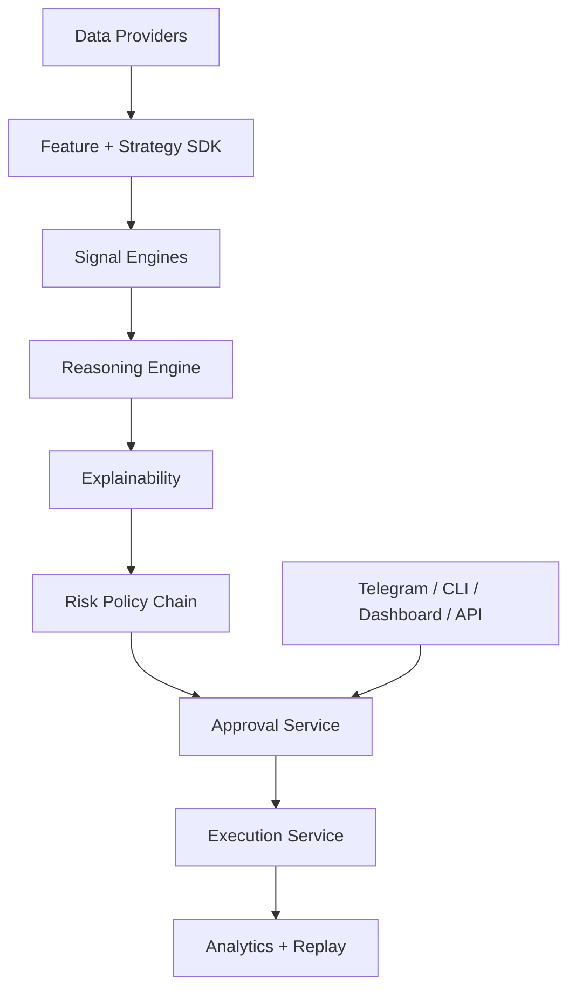

# Architecture

```mermaid
flowchart TD
    A["Data Providers"] --> B["Feature + Strategy SDK"]
    B --> C["Signal Engines"]
    C --> D["Reasoning Engine"]
    D --> E["Explainability"]
    E --> F["Risk Policy Chain"]
    F --> G["Approval Service"]
    G --> H["Execution Service"]
    H --> I["Analytics + Replay"]
    J["Telegram / CLI / Dashboard / API"] --> G
```

The framework is event-driven. Each stage emits structured events that power replay, audit, and async integrations.
