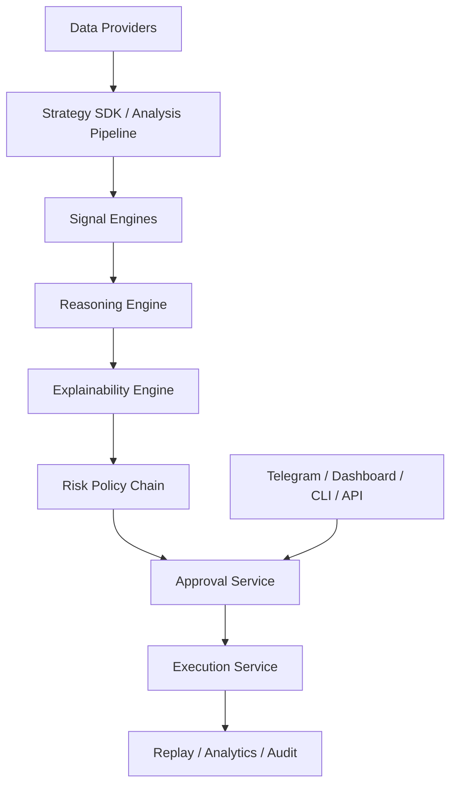

# Architecture

`ai-trading-framework` is an approval-first AI trading workflow framework. It is designed to give developers a reusable runtime for building operator-facing trading copilots rather than a single fixed strategy or broker app.

## Core Flow

The default workflow is:

`research -> signals -> reasoning -> explainability -> risk -> approval -> execution -> replay`

## Main Runtime Components

### `FrameworkBuilder`

Builds the runtime container with first-party defaults:

- demo providers
- reasoning engine
- broker adapters
- notifier
- event bus
- metrics registry
- auth service
- SQLAlchemy run store

### `AnalysisPipeline`

Builds a `MarketContext` and generates recommendations by orchestrating:

- market, news, fundamental, and sentiment providers
- a `TradingStrategy`
- one or more `SignalEngine` implementations
- a `ReasoningEngine`

### `WorkflowEngine`

Handles the control-plane workflow after recommendations are created:

- emits typed events
- evaluates deterministic risk policies
- generates explanations
- creates approval requests
- previews and submits orders through the execution service

### `OperatorRuntime`

Acts as the façade used by the API, dashboard, Telegram, and CLI. It:

- stores active runs and recommendations in memory
- persists them through the run store
- handles approval and rejection actions
- exposes replay, positions, and execution helpers
- sends operator notifications

## Event Model

The framework is event-driven. The current event types are:

- `MarketContextBuilt`
- `FeaturesComputed`
- `SignalGenerated`
- `RecommendationCreated`
- `ExplanationGenerated`
- `RiskEvaluated`
- `ApprovalRequested`
- `ApprovalGranted`
- `ApprovalRejected`
- `ExecutionRequested`
- `ExecutionCompleted`
- `ExecutionFailed`

These events power:

- replay
- auditability
- future async subscribers
- operator debugging

## Approval-First Invariant

The framework is human-in-the-loop by default.

- Paper trading can execute without a manual approval token.
- Non-paper brokers require risk approval and a valid approval token.
- Approval tokens are single-use and become `CONSUMED` after execution.
- `HOLD` recommendations are blocked from execution.

## Persistence Model

The current runtime persists:

- runs and event history
- operator identities and sessions
- OIDC state
- broker auth sessions

The default production store is Postgres through SQLAlchemy.

## Extension Surfaces

Developers can extend the framework at two levels.

### High-level

Use the Strategy SDK:

- `TradingStrategy.scan()`
- `TradingStrategy.analyze()`

This is the low-friction path for one-file strategies.

### Low-level

Implement framework interfaces such as:

- `StrategyProvider`
- `SignalEngine`
- `ReasoningEngine`
- `RiskPolicy`
- `BrokerClient`
- `Notifier`
- `LLMProvider`

## Operator Surfaces

The same core runtime is exposed through:

- FastAPI
- dashboard HTML shell
- Telegram webhook and callbacks
- CLI

## Next Reading

- [Framework Deep Dive](./framework_deep_dive.md)
- [Build With The Framework](./build_with_framework.md)
- [Strategy SDK](./strategy_sdk.md)
- [Plugins](./plugins.md)
